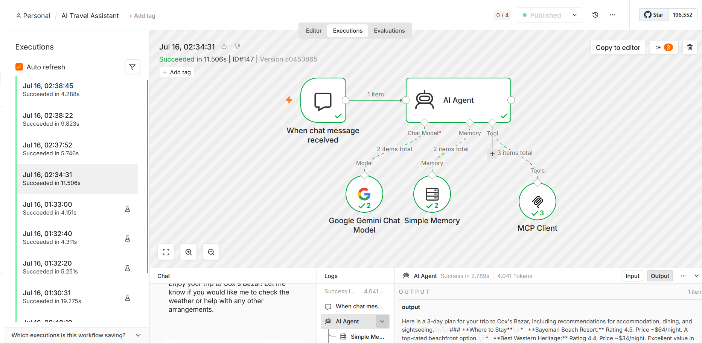
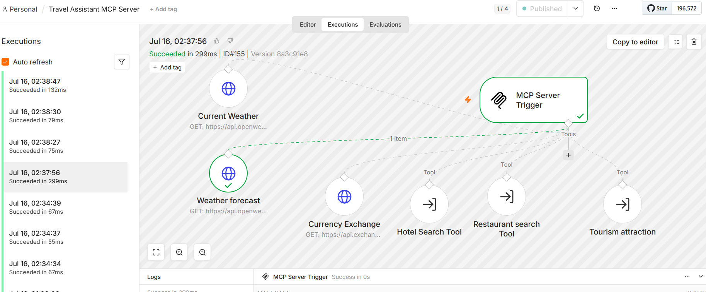

# AI Travel Assistant — n8n + MCP

An AI-powered travel assistant built with **n8n, Google Gemini, and the Model Context Protocol (MCP)**.

The system allows users to ask travel-related questions through a chat interface. The AI Agent intelligently selects the required MCP tool to provide information about weather, weather forecasts, hotels, restaurants, tourist attractions, and currency exchange.

---

## 🌍 Project Overview

This project demonstrates how **AI Agents and MCP can be combined to create a modular travel assistant**.

Instead of connecting every external service directly to the AI Agent, the project uses an **MCP Server** to expose travel capabilities as independent tools.

The AI Agent communicates with the MCP Server through an **MCP Client**, allowing it to select and use the appropriate tool based on the user's request.

### Example Requests

- "What's the current weather in Cox's Bazar?"
- "What's the weather forecast for tomorrow?"
- "Find hotels in Cox's Bazar."
- "Find restaurants in Dhaka."
- "What tourist attractions are available in Sylhet?"
- "Convert USD to BDT."
- "Plan a trip to Cox's Bazar."

---

# 🏗️ System Architecture

```text
                    ┌──────────────────────────┐
                    │        User Chat         │
                    └────────────┬─────────────┘
                                 │
                                 ▼
                    ┌──────────────────────────┐
                    │     n8n Chat Trigger     │
                    └────────────┬─────────────┘
                                 │
                                 ▼
                    ┌──────────────────────────┐
                    │        AI Agent          │
                    │                          │
                    │     Google Gemini        │
                    │     + Simple Memory      │
                    └────────────┬─────────────┘
                                 │
                                 ▼
                    ┌──────────────────────────┐
                    │        MCP Client        │
                    └────────────┬─────────────┘
                                 │
                                 │ MCP
                                 ▼
                ┌────────────────────────────────┐
                │         MCP Server              │
                │                                │
                │  ┌──────────────────────────┐  │
                │  │ Current Weather          │  │
                │  │ Weather Forecast         │  │
                │  │ Currency Exchange        │  │
                │  │ Hotel Search             │  │
                │  │ Restaurant Search        │  │
                │  │ Tourist Information      │  │
                │  └──────────────────────────┘  │
                └────────────────────────────────┘
```

---

# 🔄 How the System Works

## 1. User Sends a Travel Request

The user interacts with the assistant through the n8n chat interface.

```text
User
  ↓
Chat Message
```

---

## 2. AI Agent Analyzes the Request

The AI Agent uses **Google Gemini** as its language model.

The agent determines which travel tool is required based on the user's request.

```text
Weather question
        ↓
Current Weather tool

Future weather question
        ↓
Weather Forecast tool

Hotel question
        ↓
Hotel Search tool

Restaurant question
        ↓
Restaurant Search tool

Tourist attraction question
        ↓
Tourist Information tool

Currency question
        ↓
Currency Exchange tool
```

---

## 3. MCP Client Connects the AI Agent to the Tools

The AI Agent uses an **MCP Client** to communicate with the Travel Assistant MCP Server.

The MCP Client exposes these selected tools:

- `Restaurant_search_Tool`
- `Hotel_Search_Tool`
- `Tourism_attraction`
- `Currency_Exchange`
- `Weather_forecast`
- `Current_Weather`

This creates a modular architecture where the AI Agent does not need to directly manage every individual travel service.

---

# 🧩 MCP Server

The MCP Server is implemented as a separate n8n workflow.

It uses an **MCP Server Trigger** and exposes travel capabilities as MCP tools.

```text
                    MCP Server Trigger
                            │
          ┌─────────────────┼──────────────────┐
          │                 │                  │
          ▼                 ▼                  ▼
   Current Weather   Weather Forecast   Currency Exchange
          │                 │                  │
          └─────────────────┬──────────────────┘
                            │
              ┌─────────────┼─────────────┐
              │             │             │
              ▼             ▼             ▼
        Hotel Search   Restaurant Search   Tourist
                                           Information
```

---

# 🌦️ Weather Tools

## Current Weather

The **Current Weather** tool uses the OpenWeather API to retrieve current weather information.

The tool is designed to return:

- Temperature
- Weather condition
- Humidity
- Wind speed

The city is provided dynamically by the AI Agent.

---

## Weather Forecast

The **Weather Forecast** tool uses the OpenWeather forecast endpoint.

It provides:

- Today's forecast
- Tomorrow's forecast
- Date
- Temperature
- Weather condition

---

# 💱 Currency Exchange

The **Currency Exchange** tool provides exchange-rate information between currencies.

The AI Agent can use this tool when the user asks for currency conversion or exchange-rate information.

Example:

```text
User:
Convert 100 USD to BDT.

AI Agent
    ↓
Currency Exchange
    ↓
Exchange Rate
    ↓
Formatted Response
```

---

# 🏨 Hotel Search

The **Hotel Search Tool** is implemented as a separate n8n workflow.

The workflow follows this process:

```text
MCP Tool
   ↓
City Input
   ↓
SerpAPI
   ↓
Google Maps Search
   ↓
JavaScript Processing
   ↓
Hotel Results
```

The workflow searches for hotels using **SerpAPI's Google Maps engine**.

The returned hotel information can include:

- Hotel name
- Rating
- Reviews
- Type
- Price
- Address
- Latitude
- Longitude

The workflow processes the search results and returns up to five hotels.

---

# 🍽️ Restaurant Search

The MCP Server also exposes a separate **Restaurant Search Tool**.

The AI Agent can use this tool when users ask about:

- Restaurants
- Cafes
- Food
- Places to eat

The city is passed dynamically from the AI Agent to the underlying workflow.

---

# 🏝️ Tourist Information

The MCP Server exposes a **Tourist Information** workflow for travel destinations and attractions.

It can be used when users ask about:

- Tourist attractions
- Sightseeing
- Landmarks
- Famous places
- Things to see

The city is passed from the AI Agent to the tourism workflow.

---

# 🤖 AI Agent

The AI Agent is responsible for understanding the user's request and selecting the appropriate tool.

The system prompt defines specific tool-selection rules.

For example:

```text
Current weather
      ↓
Current Weather

Future weather
      ↓
Weather Forecast

Hotels
      ↓
Search Hotels

Restaurants
      ↓
Search Restaurants

Tourist attractions
      ↓
Tourist Information

Currency
      ↓
Currency Exchange
```

The agent can also combine multiple tools when the user requests multiple categories of information.

For example:

```text
Plan a trip to Cox's Bazar.
Include hotels, restaurants, attractions, and weather.
```

The AI Agent can determine which tools are required and combine their results into one response.

---

# 🧠 Conversation Memory

The project uses **Simple Memory** connected to the AI Agent.

The configured context window allows the assistant to maintain recent conversation context.

This helps the assistant remember information shared earlier in the same conversation, such as:

- Destination
- Budget
- Hotel preferences
- Food preferences
- Transportation preferences
- Activities

---

# 🔌 Model Context Protocol (MCP)

MCP provides the communication layer between the AI Agent and the travel tools.

Instead of implementing every tool directly inside the AI Agent workflow:

```text
AI Agent
   │
   ├── Weather API
   ├── Hotel API
   ├── Restaurant API
   ├── Tourism API
   └── Currency API
```

the project uses:

```text
AI Agent
    │
    ▼
 MCP Client
    │
    ▼
 MCP Server
    │
    ├── Weather
    ├── Forecast
    ├── Hotels
    ├── Restaurants
    ├── Tourism
    └── Currency
```

This makes the architecture more modular and allows additional tools to be added to the MCP Server.

---

# 🛠️ Technology Stack

| Technology | Purpose |
|---|---|
| **n8n** | Workflow automation and AI orchestration |
| **Google Gemini** | Large language model |
| **MCP** | Tool communication protocol |
| **MCP Client** | Connects AI Agent to MCP tools |
| **MCP Server** | Exposes travel capabilities |
| **OpenWeather API** | Current weather and forecasts |
| **SerpAPI** | Google Maps hotel search |
| **JavaScript** | Processing and formatting search results |
| **n8n Chat Trigger** | User interaction |

---

# ✨ Key Features

- 🤖 AI-powered travel assistant
- 💬 Conversational chat interface
- 🧠 Conversation memory
- 🔌 MCP-based tool architecture
- 🌦️ Current weather information
- 📅 Weather forecast
- 🏨 Hotel search
- 🍽️ Restaurant search
- 🏝️ Tourist attraction information
- 💱 Currency exchange
- 🧩 Modular n8n workflows
- 🔄 Dynamic tool selection
- 🔗 Separate MCP Server and MCP Client architecture

---

# 📸 Workflow Screenshots

## AI Travel Assistant



## Travel Assistant MCP Server



---

# 📁 Project Structure

```text
ai-travel-assistant-mcp/
│
├── README.md
│
├── screenshots/
│   ├── ai-travel-assistant.png
│   └── mcp-server.png
│
└── workflows/
    ├── AI-Travel-Assistant.json
    ├── Travel-Assistant-MCP-Server.json
    └── Hotel-Search-Tool.json
```

---

# 📦 Included Workflows

## 1. AI Travel Assistant

Main conversational workflow containing:

```text
Chat Trigger
     ↓
AI Agent
     ↓
Google Gemini
     +
Simple Memory
     +
MCP Client
```

---

## 2. Travel Assistant MCP Server

MCP server workflow containing:

```text
MCP Server Trigger
       │
       ├── Current Weather
       ├── Weather Forecast
       ├── Currency Exchange
       ├── Tourism Information
       ├── Hotel Search
       └── Restaurant Search
```

---

## 3. Hotel Search Tool

Independent workflow used by the MCP Server for hotel searches.

```text
Workflow Trigger
      ↓
SerpAPI / Google Maps
      ↓
JavaScript Processing
      ↓
Hotel Results
```

---

# 🔐 Security Note

The workflow files included in this repository are intended for portfolio and educational purposes.

**API keys and private credentials must never be committed to a public GitHub repository.**

Before importing these workflows:

1. Open the workflow in n8n.
2. Add your own API credentials.
3. Replace placeholder values with your own credentials.
4. Configure the required services.
5. Update the local MCP endpoint for your own environment if necessary.

Never publish:

- API keys
- Passwords
- OAuth secrets
- Private tokens
- Production credentials
- Private webhook URLs

---

# ⚠️ Environment Notes

The original workflow uses an MCP endpoint configured for a local n8n/Docker environment.

When running this project in another environment, the MCP endpoint may need to be changed to match the new n8n instance.

Example:

```text
Local development
        ↓
http://host.docker.internal:8080/mcp/travel-assistant
```

Configure the endpoint according to the environment where the MCP Server workflow is running.

---

# 🚀 What This Project Demonstrates

This project demonstrates practical experience with:

- AI Agent development
- n8n workflow automation
- Google Gemini integration
- Model Context Protocol (MCP)
- MCP Client / MCP Server architecture
- AI tool calling
- API integrations
- Conversational memory
- Modular workflow design
- External search integrations
- JavaScript data processing
- Real-time travel information workflows

---

# 💡 Potential Use Cases

The architecture can be adapted for:

- Travel planning assistants
- Hotel recommendation systems
- Tourism chatbots
- Travel agency automation
- Destination information assistants
- Customer travel support
- Multi-tool AI assistants
- AI-powered booking assistants

---

# 🔮 Possible Future Improvements

Potential extensions include:

- Flight search integration
- Hotel booking integration
- Restaurant reservation integration
- Map and route planning
- Itinerary generation
- Budget calculation
- Personalized travel plans
- More travel APIs
- Production database integration
- Authentication
- Web-based frontend
- Cloud deployment

---

# 👨‍💻 Author

**Sabuj Chandra Das**

AI Automation Engineer

- GitHub: https://github.com/sabuj-chandra-das
- Portfolio: https://sabuj-chandra-das.lovable.app

---

## ⭐ Project Highlights

**AI Agent + MCP + n8n + Google Gemini + Real-Time Travel Tools**

A modular AI travel assistant demonstrating how MCP can connect an AI Agent with multiple specialized tools and external services.
